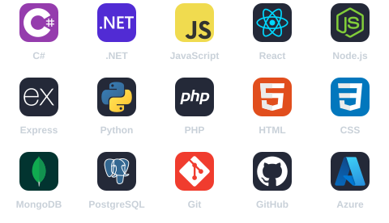
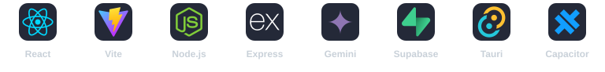
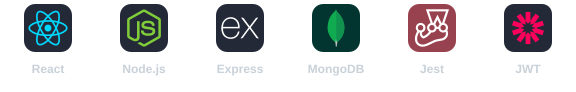
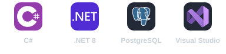
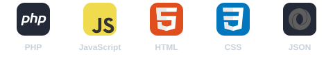

  

  Étudiant en 2e année de BUT Informatique à l’IUT d’Annecy 
  À la recherche d’une alternance en développement logiciel, backend ou full stack dès septembre 2026

  
  
  

### À propos de moi

J’aime transformer un besoin métier en une application claire, fiable et maintenable. Je m’intéresse particulièrement à l’architecture backend, aux applications full stack, à l’intelligence artificielle et aux expériences multiplateformes.

- Étudiant en BUT Informatique à l’Université Savoie Mont Blanc
- Expérience full stack sur un ERP développé avec la stack MERN
- Développement de Lumora, un maître du jeu IA vocal
- Basé à Annecy, France
- Recherche une alternance de 12 mois pour l’année 2026-2027

### Compétences principales

  

### Projets sélectionnés

#### Lumora

Maître du jeu IA vocal pour vivre des aventures collaboratives et immersives autour d’un appareil partagé.

> Le code source de Lumora est privé. Le dépôt public présente uniquement le produit, ses fonctionnalités et son architecture générale.

#### Designet ERP

ERP full stack couvrant les ventes, achats, stocks, clients, fournisseurs, utilisateurs, rapports et tableaux de bord.

#### Sibilia

Application Windows de gestion de commandes, clients, plats et indicateurs d’activité connectée à PostgreSQL.

#### App-biathlon

Application web conçue en équipe pour gérer des profils et des sessions de tir dans le cadre d’un projet d’ingénierie.

### En ce moment

- J’approfondis C#, .NET, JavaScript et l’intégration de services IA
- Je développe Lumora tout en conservant son code source strictement privé
- Je recherche une équipe dans laquelle contribuer à une application réelle et progresser

### Me contacter

> [!IMPORTANT]
> Je suis disponible pour échanger au sujet d’une alternance en développement backend, full stack, logiciel ou IA à partir de septembre 2026.

  

